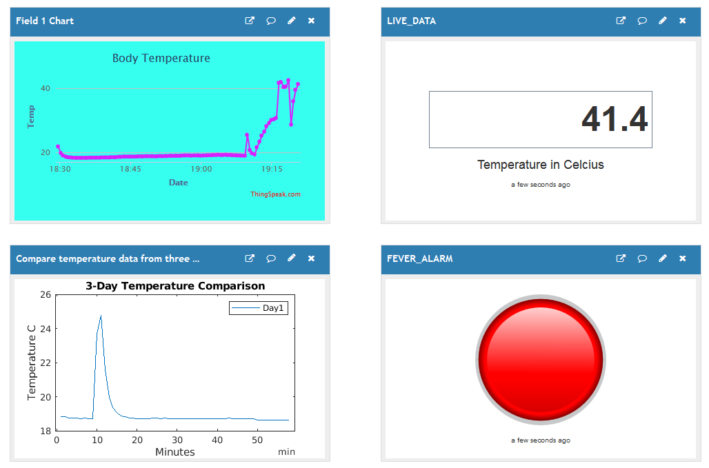

#  COVIDUS

  IOT based system for medical data collection and analysis. This application runs on an WiFi connected ESP8266 NodeMCU which gets readings from a Dallas DS18B20 temperature sensor (later on a MELEXIS sensor). Many sensors can be connected in OneWire bus giving a range of different medical data. These data are uploaded on a constant basis into ThingSpeak (https://thingspeak.com) cloud data analysis service where are processed and displayed accordingly. The software reads also the serial No of the attached devices so to respectfully fill the patient's records in database.
  
## Live data for  [ https://crowdhackathon.com/antivirus/ ]
 https://thingspeak.com/channels/1029493
 
 http://api.thingspeak.com/channels/1029493/charts/1
 
 https://thingspeak.com/apps/matlab_visualizations/339088

 
### Prerequisites

A NodeMCU 8266 development board

A Dallas 18B20 temperature sensor 

Adruino IDE

### Installing

You need to load these libraries to Arduino IDE

OneWire https://www.arduinolibraries.info/libraries/one-wire

Dallas https://www.arduinolibraries.info/libraries/dallas-temperature

* Go to **ThingSpeak** and SignUp

Copy your API Key and WiFi credentials into covidus.ino

## Built With

* [Arduino IDE](https://www.arduino.cc/en/main/software) 

## Authors

* **Chris Papathanasiou** - *Initial work* 

See also the list of [contributors](https://github.com/crispSV/Biometrics/blob/master/contributors) who participated in this project.

## License

This project is licensed under the MIT License - see the [LICENSE.md](LICENSE.md) file for details

## Acknowledgments

* This code is initialy written for Antivirus Hackathlon https://crowdhackathon.com/antivirus/ entry

